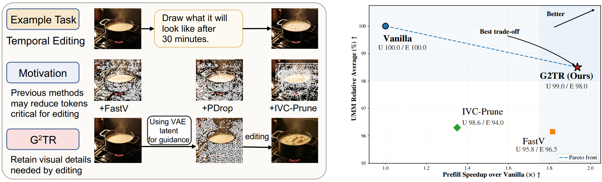
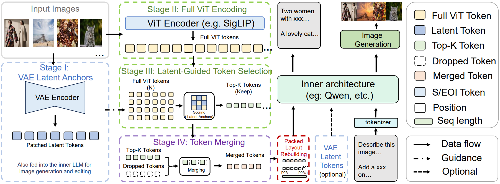
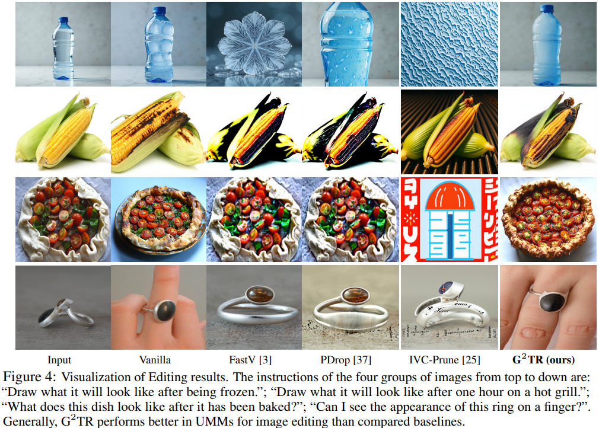
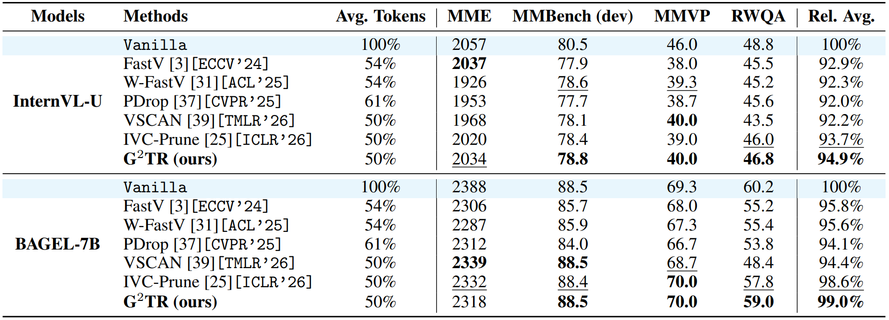
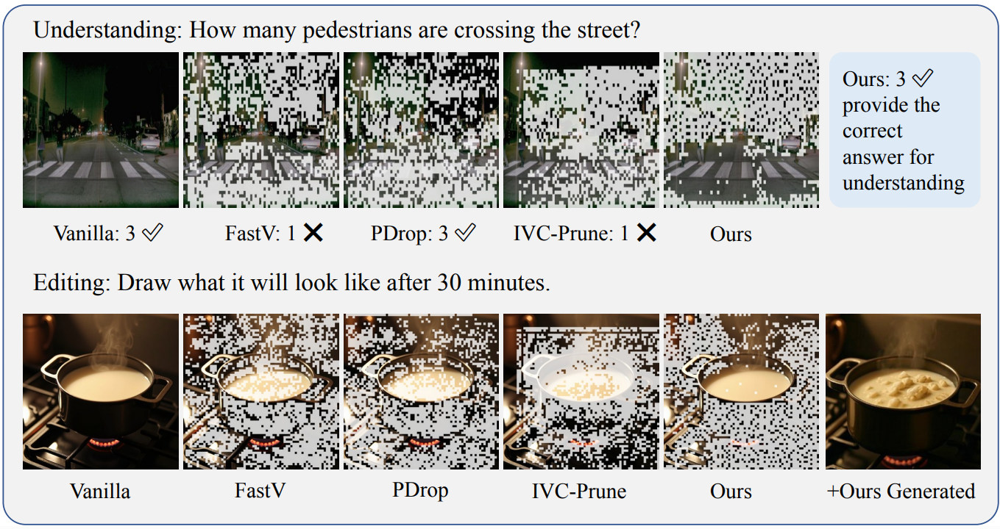

# G^2TR: Generation-Guided Visual Token Reduction for Separate-Encoder Unified Multimodal Models  

[Junxian Li](https://lijunxian111.github.io), [Kai Liu](https://kai-liu.cn), [Zizhong Ding](https://openreview.net/profile?id=~Zizhong_Ding1), [Zhixin Wang](https://scholar.google.com/citations?user=tZS6bPMAAAAJ&hl=en&oi=sra), [Zhikai Chen](https://scholar.google.com/citations?hl=en&user=6EW56pIAAAAJ), [Renjing Pei](https://scholar.google.com/citations?hl=en&user=zEEMPUUAAAAJ&view_op=list_works&sortby=pubdate), and [Yulun Zhang](https://yulunzhang.com)

"G^2TR: Generation-Guided Visual Token Reduction for Separate-Encoder Unified Multimodal Models", arXiv 2026  

<div>
<a href="https://github.com/lijunxian111/G2TR/releases" target='_blank' style="text-decoration: none;"></a>
<a href="https://github.com/lijunxian111/G2TR" target='_blank' style="text-decoration: none;"></a>
<a href="https://arxiv.org/abs/2605.12309"></a>
<a href="https://github.com/lijunxian111/PlanViz/stargazers" target='_blank' style="text-decoration: none;"></a>
</div>  


[project] [[supplementary material](https://github.com/lijunxian111/G2TR/releases/tag/v1/supple.pdf)]

#### 🔥🔥🔥 News

- **2026-05-13:** This repo is released.


---

> **Abstract:** The development of separate-encoder Unified multimodal models (UMMs) comes with a rapidly growing inference cost due to dense visual token processing. In this paper, we focus on understanding-side visual token reduction for improving the efficiency of separate-encoder UMMs. While this topic has been widely studied for MLLMs, existing methods typically rely on attention scores, text-image similarity and so on, implicitly assuming that the final objective is discriminative reasoning. This assumption does not hold for UMMs, where understanding-side visual tokens must also preserve the model's capabilities for editing images.
> We propose G^2TR, a generation-guided visual token reduction framework for separate-encoder UMMs. Our key insight is that the generation branch provides a task-agnostic signal for identifying understanding-side visual tokens that are not only semantically relevant but also important for latent-space image reconstruction and generation. G^2TR estimates token importance from consistency with VAE latent, performs balanced token selection, and merges redundant tokens into retained representatives to reduce information loss. The method is training-free, plug-and-play, and applied only after the understanding encoding stage, making it compatible with existing UMM inference pipelines. Experiments on image understanding and editing benchmarks show that G^2TR substantially reduces visual tokens and prefill computation by 1.94x while maintaining both reasoning accuracy and editing quality, outperforming baselines on almost all benchmarks.



---

### Pipeline



---

## 🔖 TODO

TBD

## 🔗 Contents
1. [Testing](#testing)
2. [Results](#results)
3. [Acknowledgements](#acknowledgements)


## <a name="testing"></a>📄 Testing  

TBD

## <a name="results"></a>🔎 Results

We present the performance of G^2TR compared with previous SOTA methods.

<details open>
<summary>Main Results (click to expand)</summary>

- Results in Fig. 4 of the main paper

<p align="center">
  
</p>

- Results in Tab. 2 of the main paper

<p align="center">
  
</p>
</details>

<details open>
<summary>Comparison of Reduced Tokens (click to expand)</summary>

- Results in Fig. 5 of the main paper

<p align="center">
  
</p>
</details>

## <a name="citation"></a>📎 Citation

If you find our dataset and code helpful in your research or work, please cite the following paper.

```
@article{li2026g2tr,
      title={G$^2$TR: Generation-Guided Visual Token Reduction for Separate-Encoder Unified Multimodal Models}, 
      author={Junxian Li and Kai Liu and Zizhong Ding and Zhixin Wang and Zhikai Chen and Renjing Pei and Yulun Zhang},
      journal={arXiv preprint arXiv:2605.12309},
      year={2026}
}
```

## <a name="acknowledgements"></a>💡 Acknowledgements
This project is built based on numerous model repositories. Thanks [Bagel-7B-MoT](https://github.com/ByteDance-Seed/Bagel) and [InternVL-U](https://github.com/OpenGVLab/InternVL-U).
